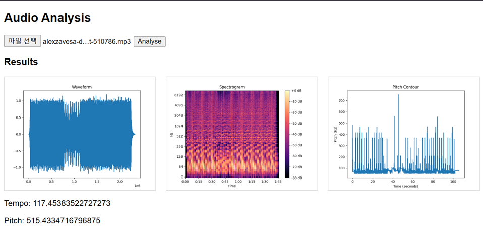
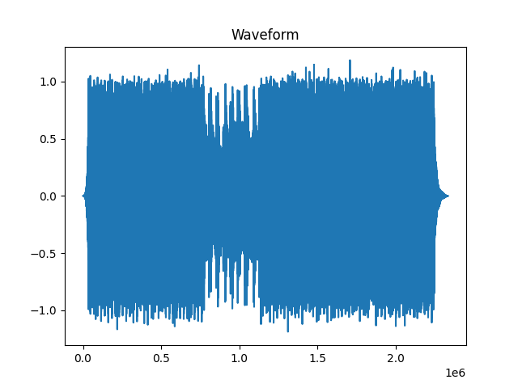
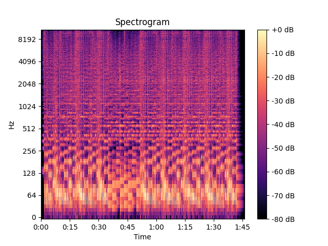
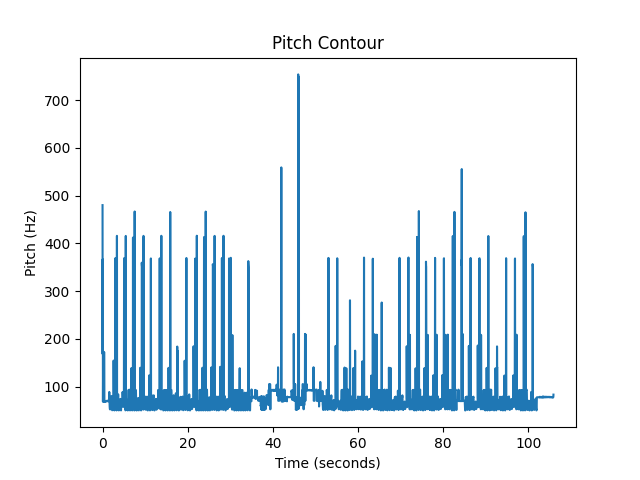

# Audio Feature Analysis and Visualisation



## Overview

This project is an audio analysis tool that extracts and visualises key features from audio signals.
It allows users to upload an audio file and analyse its waveform, frequency content, tempo, and pitch.

The system is designed to demonstrate a practical understanding of audio signal processing concepts, including time-domain and frequency-domain analysis.

---

## Features

* Waveform visualisation (amplitude over time)
* Spectrogram generation (frequency content over time)
* Tempo estimation (beats per minute)
* Pitch detection (average fundamental frequency)
* Pitch contour visualisation (pitch variation over time)
* Web-based interface for uploading and analysing audio files

---

## Technologies Used

* **Python** – core programming language
* **FastAPI** – backend API development
* **Librosa** – audio analysis and signal processing
* **NumPy** – numerical computation
* **Matplotlib** – data visualisation
* **JavaScript / HTML** – frontend interface

---

## System Architecture

The application follows a simple client-server architecture:

* **Frontend**: Handles file upload and displays analysis results
* **Backend (FastAPI)**: Processes audio files and extracts features
* **Processing Layer**: Uses Librosa to perform signal analysis

---

## How It Works

1. The user uploads an audio file via the frontend
2. The file is sent to the FastAPI backend
3. The backend processes the audio:

   * Loads the signal in the time domain
   * Computes the Short-Time Fourier Transform (STFT)
   * Extracts tempo and pitch features
4. Visualisations are generated and saved as images
5. Results are returned and displayed in the browser

---

## Installation

### 1. Clone the repository

```bash
git clone <your-repo-url>
cd audio-analyser
```

### 2. Create a virtual environment

```bash
python -m venv venv
venv\Scripts\activate
```

### 3. Install dependencies

```bash
pip install -r requirements.txt
```

---

## Running the Application

### Start the backend server

```bash
cd backend
uvicorn main:app --reload
```

### Open the frontend

* Open `frontend/index.html` in your browser
* Upload a `.wav` file and click analyse

Alternatively, use the API documentation:

```
http://127.0.0.1:8000/docs
```

---

## Example Output

The system generates:

* Waveform plot

* Spectrogram

* Pitch contour graph

* Numerical values for tempo and pitch

---

## Key Concepts Demonstrated

* Audio signals as numerical time-series data
* Frequency analysis using Fourier Transform
* Feature extraction from audio signals
* Data visualisation of complex signals

---

## Limitations

* Pitch detection is approximate and may be inaccurate for polyphonic audio
* Performance depends on audio quality and format
* Currently supports basic visualisation only

---

## Future Improvements

* Real-time audio analysis
* Improved pitch detection algorithms
* Support for multiple audio formats
* Enhanced frontend UI/UX

---

## Author

This project was developed as part of a portfolio to demonstrate practical skills in audio signal processing and backend development.

